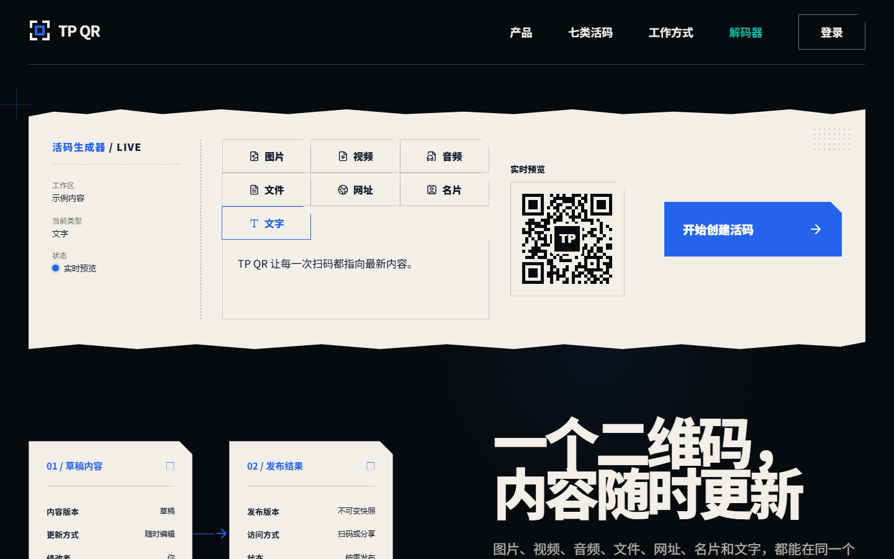

# TP QR

TP QR is an open-source dynamic QR-code workspace for individuals and small
teams. A stable slug can point to new content after each immutable publish.
The repository contains reproducible source, tests, fictional local fixtures,
and no personal Cloudflare resources.

## Homepage

[Open TP QR](https://tpqrcode.shop/)

[](https://tpqrcode.shop/)

[View the source on GitHub](https://github.com/TPB003/TP_QRCODE)

## Features

- Seven active-code types: image, video, audio, file, URL, contact (vCard), and text.
- Email verification-code login, session protection, draft autosave, preview,
  revision conflict detection, and immutable published versions.
- Browser-generated PNG, SVG, WEBP, and JPG downloads; mobile system sharing
  with a browser-download fallback.
- Private R2 media proxy with MIME, file-signature, size, count, and ownership checks.
- One responsive public content frame with type-specific media, file, contact,
  URL, and text presentation.
- Camera, image-upload, and drag-and-drop QR decoder for TP QR slugs, URLs,
  text, and vCards.
- Scan, download, playback, and external-link events with basic rate limiting.
- Local Cloudflare D1/R2 simulation, Worker integration tests, and Playwright
  desktop/mobile acceptance tests.

Inspection, business forms, and team collaboration are not active product
features. Compatibility code may read legacy records during migration, but the
new public response never emits inspection payloads.

## Workflow

```text
login -> create code -> choose type -> edit draft -> preview -> publish
     -> render/download QR -> scan public page -> download/share -> rescan
```

## Architecture and tree

The browser owns presentation and QR rendering. The Worker owns auth,
authorization, uploads, immutable versions, public reads, and analytics. D1
stores metadata/events and R2 stays private behind Worker routes.

```text
apps/web/                 React/Vite browser app
apps/worker/              Hono/Cloudflare Worker API
packages/domain/          shared IDs, errors, API contracts
packages/content/         seven content models, vCard, safe URLs
packages/qr/              render, download, decode, validation
packages/ui/              visual tokens and responsive primitives
infra/cloudflare/         migrations, fictional seed, deployment templates
tests/                    unit, integration, browser, security, fixtures
docs/                     architecture, development, testing, security, deploy
scripts/                  fixtures and open-source boundary checks
assets/open/              small redistributable assets only
```

See [`docs/architecture/README.md`](docs/architecture/README.md) for trust
boundaries and versioning details.

## Requirements

- Node.js 22.18+
- npm 10+
- Chrome/Chromium for browser tests

## Local setup

```powershell
git clone https://github.com/TPB003/TP_QRCODE.git
Set-Location TP_QRCODE
npm ci
Copy-Item .dev.vars.example .dev.vars
npm run setup:local
npm run dev
```

The Vite app runs at `http://127.0.0.1:5173`; the Worker runs at
`http://127.0.0.1:8787`. Repeat migrations and seed after schema changes:

```powershell
npm run db:migrate:local
npm run db:seed:local
```

Wrangler local bindings are simulations and do not contact production. The
development mail adapter accepts the configured test code (`123456`) and never
sends real email. Never reuse this adapter or the fixed code in production.

## Environment variables

Copy `.dev.vars.example` to `.dev.vars` on your machine; the latter is ignored.
Production secrets belong in Cloudflare or `wrangler secret`, never in JSON.

| Variable | Purpose |
| --- | --- |
| `ENVIRONMENT` | Worker environment (`development` locally) |
| `APP_ORIGIN` | CORS and origin validation |
| `AUTH_DELIVERY_MODE` | `dev` locally; `resend` in production |
| `AUTH_TEST_CODE` | local test code |
| `AUTH_ALLOWED_EMAILS` | optional comma-separated allow-list |
| `AUTH_GOOGLE_CLIENT_ID`, `AUTH_GITHUB_CLIENT_ID` | public OAuth client IDs |
| `AUTH_GOOGLE_CLIENT_SECRET`, `AUTH_GITHUB_CLIENT_SECRET` | Cloudflare Secrets for OAuth callbacks |
| `AUTH_OAUTH_CALLBACK_ORIGIN` | callback origin (`http://127.0.0.1:8787` locally; `https://tpqrcode.shop` in production) |
| `VITE_TURNSTILE_SITE_KEY` | production browser key |
| `TURNSTILE_SECRET_KEY` | production Worker secret |
| `RESEND_API_KEY`, `RESEND_FROM_EMAIL` | production email adapter |

For production authentication, set `AUTH_DELIVERY_MODE=resend`, verify
`RESEND_FROM_EMAIL` in Resend, and store the provider key as a Cloudflare
Secret. Run `npx wrangler secret put RESEND_API_KEY` against a private
production config. Do not set `AUTH_TEST_CODE` in production, and do not use
the local `apps/worker/wrangler.jsonc` to deploy production; it intentionally
contains development bindings and the fixed local test code. See
[`docs/deployment-cloudflare.md`](docs/deployment-cloudflare.md) for the full
workers.dev/D1/R2 procedure.

## Google and GitHub login

The login page currently exposes email OTP and GitHub login. The Google OAuth
implementation remains in the Worker/API, but its button is temporarily hidden
until the provider configuration and UI are re-enabled. Configure these exact
production callbacks in the provider consoles:

```text
https://tpqrcode.shop/api/auth/google/callback
https://tpqrcode.shop/api/auth/github/callback
```

Google uses `openid email profile`. GitHub uses a GitHub App user-authorization
flow with basic profile and verified-email access only. A verified provider
email is automatically linked to an existing TP QR account; provider tokens
are never stored. Local development should use separate provider applications
with `http://127.0.0.1:8787/api/auth/{provider}/callback` callbacks. See
[`docs/deployment-cloudflare.md`](docs/deployment-cloudflare.md).

## Maintainer CLI

The repository includes a dependency-free Node 22 maintainer CLI. It does not
change registrar DNS or print secrets:

```powershell
npm run tpqr -- doctor
npm run tpqr -- local setup
npm run tpqr -- check
npm run tpqr -- domain inspect tpqrcode.shop
npm run tpqr -- oauth check
```

Deploy only with a private configuration under ignored `tmp/`:

```powershell
npm run tpqr -- deploy --environment staging --config tmp/wrangler.staging.jsonc --dry-run
```

See [`docs/cli.md`](docs/cli.md) for production preflight and release checks.

## Documentation sync

Every pull request must review the README against the user-visible change:

- Update Features and Workflow when behavior changes.
- Update the homepage screenshot when a page or navigation experience changes.
- Update CLI, environment, authentication, or Cloudflare sections when their
  commands or configuration changes.
- Keep `assets/open/homepage.png` fictional, reproducible, and free of personal
  QR payloads or production data.
- If a refactor has no user-visible effect, state in the pull request that the
  README was checked and no update was needed.

## Testing and release gate

```powershell
npm run lint
npm run typecheck
npm run test:unit
npm run test:integration
npm run test:security
npm run test:browser
npm run build
npm run check:opensource
git diff --check
```

The complete local gate is:

```powershell
npm ci
npm run setup:local
npm run check:all
npm run check:opensource
git diff --check
```

Every type must pass create, edit, draft, preview, publish, scan, public
render, download/share, republish, and rescan. Browser tests cover 1440x900,
390x844, and 375x812 with no page-level overflow or console errors. See
[`docs/testing.md`](docs/testing.md).

## Build and preview

```powershell
npm run build
npm run preview
```

The generated `dist/` directory is local output and must not be committed.

## Cloudflare custom domain

The domain `tpqrcode.shop` is registered at West Digital. Cloudflare Free is
used for DNS, HTTPS, and the Worker custom domain; the domain is not
transferred to Cloudflare. First delegate the domain's Nameservers to
Cloudflare, then attach `tpqrcode.shop` under the Worker **Domains & Routes**
page. Cloudflare creates the certificate and DNS mapping. Follow
[`docs/deployment-cloudflare.md`](docs/deployment-cloudflare.md) for the exact
steps and private configuration flow.

Cloudflare Free/global routing may be unstable on some mainland-China
networks. A stable mainland route would require a separate domestic/ICP or
eligible Cloudflare China Network plan and is not promised by this project.

This repository never claims that a remote resource, domain, account ID, or
production dataset already exists.

## Limitations and security

Local verification codes are for development only. Production needs real email,
Turnstile, HTTPS cookies, logging, alerts, and backups. R2 is private and is
never exposed as a public bucket. Teams, billing, notifications, plugins, and
super-admin controls are outside the MVP.

Run `npm run check:opensource` before publishing. Review
[`CONTRIBUTING.md`](CONTRIBUTING.md), [`SECURITY.md`](SECURITY.md), and
[`THIRD_PARTY_NOTICES.md`](THIRD_PARTY_NOTICES.md).

## License

MIT License. See [`LICENSE`](LICENSE).
